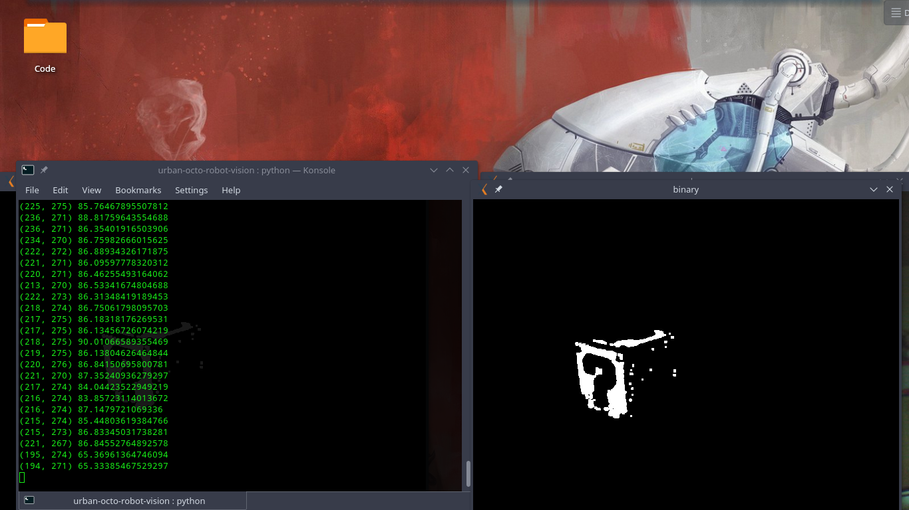

# Robot Vision
For this example you will need to use your own computer camera or an external. The way we will be usining it is through ip on a local network. In java we will set up the ip cameras with frc's guide lines. Once that is done what will happen is that we will show the feed to some kind of viewport. After that we will process it for data for auton like colors and distance then send it back to the robot. 

## Screenshots

### Resources
 - http://opencv-python-tutroals.readthedocs.io/en/latest/py_tutorials/py_setup/py_setup_in_windows/py_setup_in_windows.html
 - https://github.com/Team2168/2168_Vision_Example
 - https://github.com/wpilibsuite/opencv

